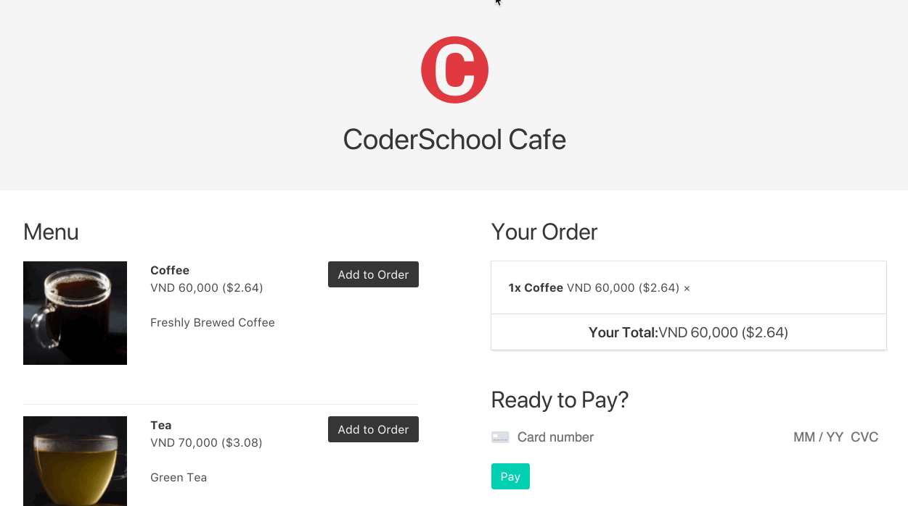

# CoderSchool Coffee Shop

A coffee shop ordering app built using Create React App and Bulma. It connects to Stripe and processes payments.

## Walkthrough

### User Stories

- Menu displays available food items incl. price
- User can add menu items to order in real time
- Items can be removed from order
- Order total is updated continuously
- Price is displayed both in VND and in USD
- User can input credit card information (with validation)
- Loading screen while payment is being processed
- Stripe processes payments
- Receipt shows up after Stripe confirms transaction